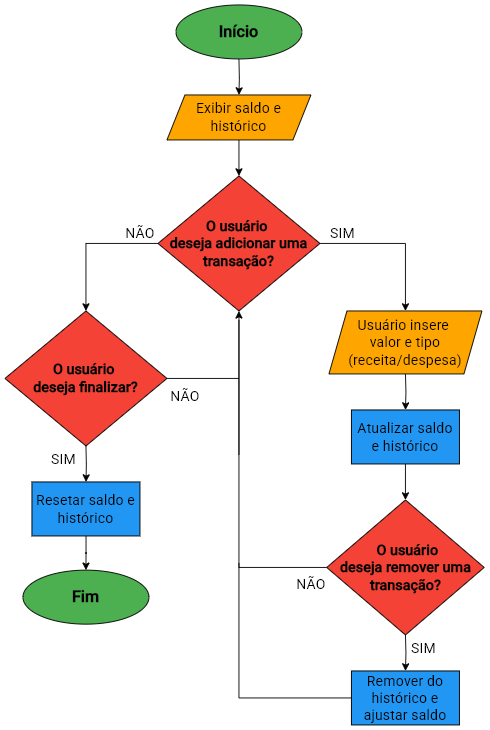

# Finance Tracker 💰

Gerencie suas finanças de forma simples e eficiente! O **Finance Tracker** é uma aplicação web que permite registrar receitas e despesas, fornecendo um resumo financeiro atualizado em tempo real.

---

## 📌 Funcionalidades

✅ Adicionar saldo inicial na conta<br>
✅ Registrar receitas e despesas<br>
✅ Visualizar histórico de movimentações<br>
✅ Cálculo automático do saldo final<br>
✅ Interface amigável e responsiva<br>

---

## 🛠️ Tecnologias Utilizadas

- **HTML5** → Estrutura da aplicação
- **CSS3** → Estilização e layout responsivo
- **JavaScript (ES6+)** → Manipulação do DOM e lógica da aplicação

---

## 📂 Estrutura do Projeto

```
📂 Finance-Tracker
│── 📂 assets
│   ├── 📂 css  # Estilos
│   ├── 📂 icons  # Ícone
│   ├── 📂 images  # Fluxograma
│   ├── 📂 js  # Código JavaScript
│── index.html  # Página principal
│── README.md  # Documentação do projeto
```

---

## 🚀 Como Executar o Projeto

1. Clone o repositório:
   ```bash
   git clone https://github.com/felipemedola/finance-tracker.git
   ```

2. Acesse a pasta do projeto:
   ```bash
   cd finance-tracker
   ```

3. Abra o arquivo `index.html` em seu navegador.

---

## 🔍 Fluxograma do Projeto

Caso queira entender melhor a lógica da aplicação, consulte o fluxograma abaixo:



---

## 📄 Licença

Este projeto está licenciado sob a **MIT License** - veja o arquivo [LICENSE](LICENSE) para mais detalhes.

---

💡 **Contribua!** Caso tenha sugestões ou melhorias, sinta-se à vontade para abrir uma issue ou enviar um pull request. 😉

